# 🎨 Layout Styled with CSS

## Index Page
- Font family `Sono`
- Centered all divs in CSS
- Increase `Search Bar`'s width
- Styled `submit button` with hover effect CSS
- Created a Bootstrap container `jumbotron` to display announcements
- Used `LottieFiles` for animated icons

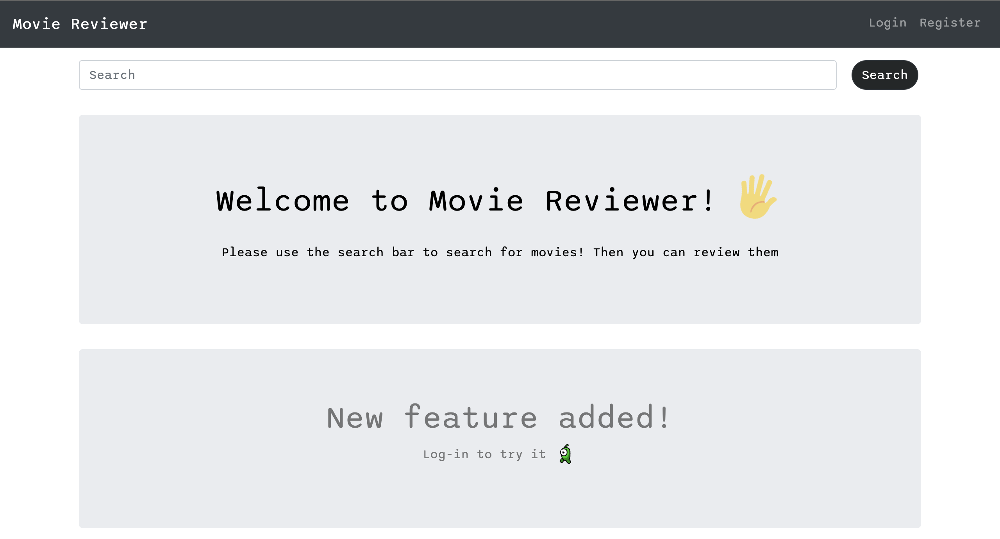

## Query Results Page
- Created a slider for movies with Bootstrap `carousel slide`, two buttons to go previous or next movie to show up
- Slider goes next automatically every 5 seconds when pointer is not focusing it.
- Displayed query results (movie posters) into 4 columns, used Bootstrap
- Styled these movie posters with CSS, with hover effect when user's cursor points to them
- Note: For future implementation, I would add a 5-stars review for each movie to be displayed instead of `HD` element. A new `form` method post so that user enters the amount of stars for the movie being reviewed. Then calculated the amount of stars to be displayed based on the total user's stars average

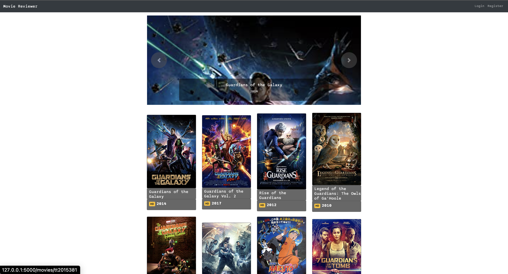

## Movie Detail Page
- Styled the box that contains the movie information with hover effect in CSS
- Added a placeholder for `comment`
- CSS the submit button `Enter comment`

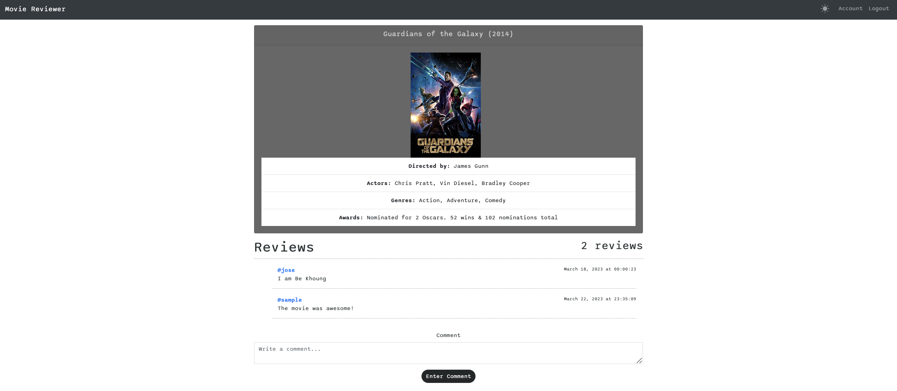

## User Detail Page
- Style the profile avatar with a border radius of 25%
- CSS the poster movie with hover effect
- Added a  Bootstrap icon `quotes` at the beginning of a user's comment

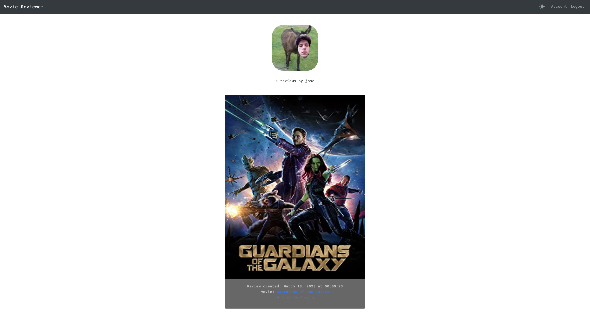

## Log In Page
- Centered divs
- Added placeholders
- Styled the `Log In` button with Bootstrap

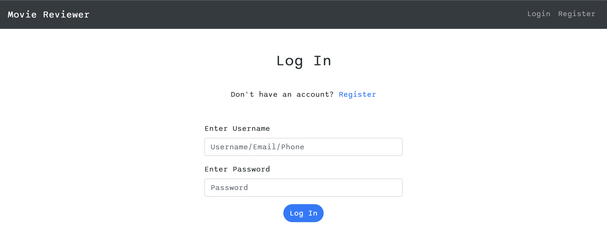

## Register Page
- Added placeholders with icons
- Styled the submit button with CSS

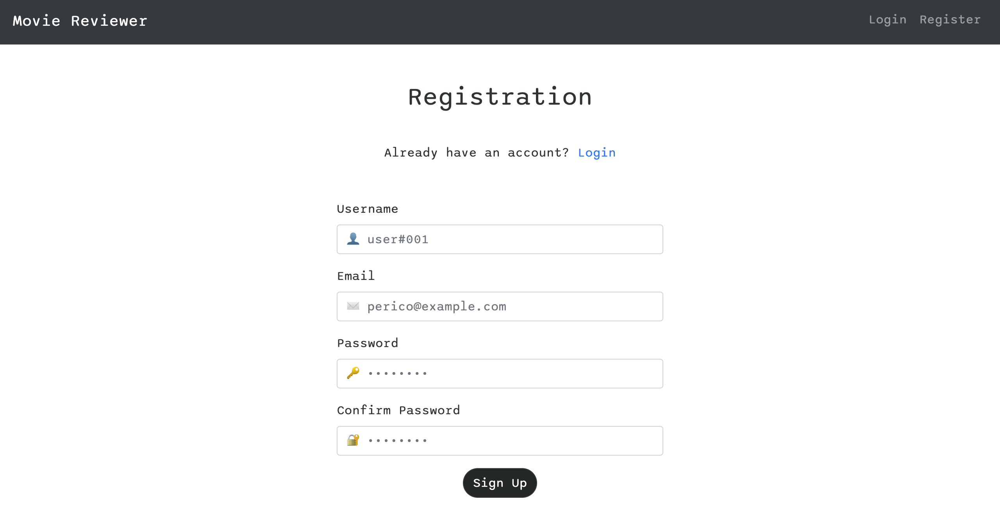

## Account Page
- Added a static badge for users to show account accomplishment and veracity.
- **Note**: future implementation to enabling this badge based on the number of reviews made by this user. Audience critic or public critic may be also added.

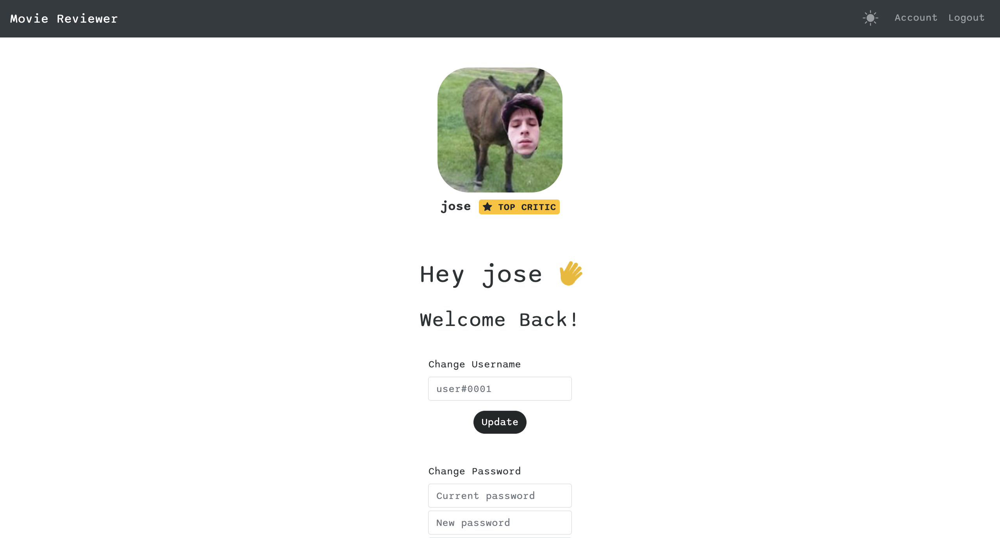

## 404 Page
- Added lottiefiles in this page
- Used Bootstrap to display the divs into two columns

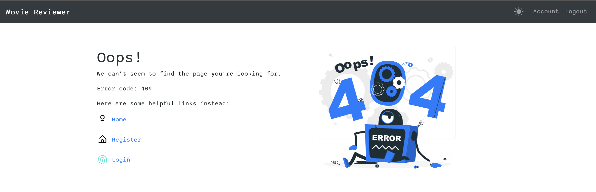

## Flash Messages 
- Styled Flash messages to appear at the top of the screen
- Used Bootstrap to style the flash messages's divs
- Flash messages dissapear after 10 seconds, and the space taken by these flash messages also dissapear with an effect done in CSS

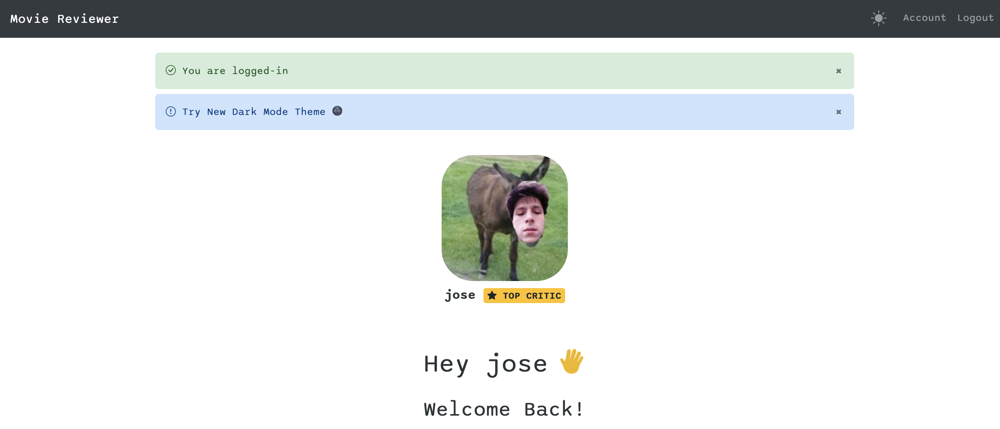

# ✍️ New Features

## Dark Theme Feature for Users (`header.html`)
- New feature exclusive for logged-in users
- Users can change to dark theme or ligth theme
- Used Ligth theme and Dark theme icon from Bootstrap
- Used `form post` to save the theme mode of an user in the database (header.html)
- Each user has their own theme, modified User in models.py
- The chosen theme is applied for all pages
- When user log out and log in, the page will load the theme they left from previous session
- For this implementation, used inline JS code (script tag) , `current_user` field, and inline CSS (style tag) in header.html
- **Note**: downside, the page reloads everytime theme icon is clicked because of submit `form post`. Future implementation, when clicking on logout, submit `form post` to save user's theme and then logout (maybe), to avoid page reloads and reduce post and get request from database. 

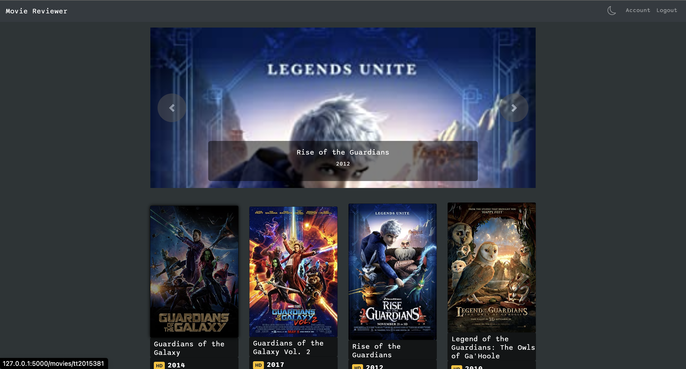

## Change Password (`account.html`)
- Added new form for updating password (account.html and forms.py)
- Current password needs to match with the current user session otherwise prompt error message
- New password and confirm password must be the same in order to update the password

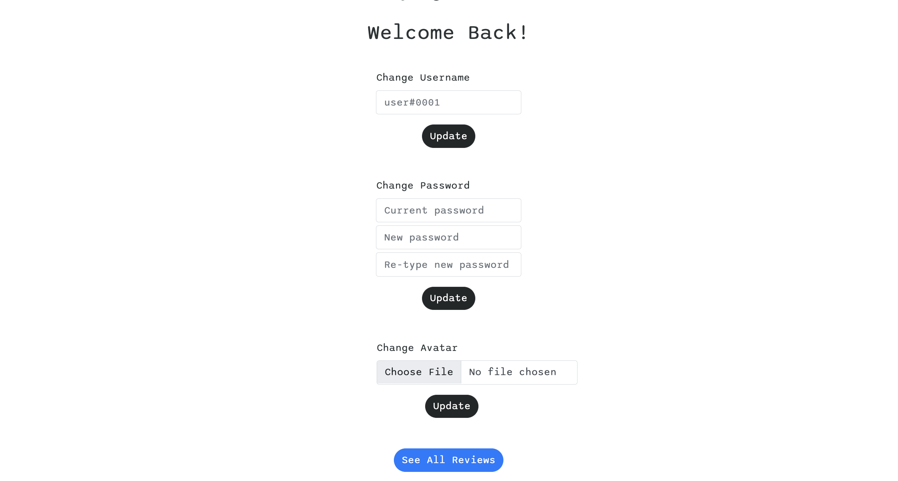

## Default Avatar (`register.html`)
- Added a default image for new user accounts
- Source image is stored locally in the app
	- Source: `./flask_app/static/default.jpg`

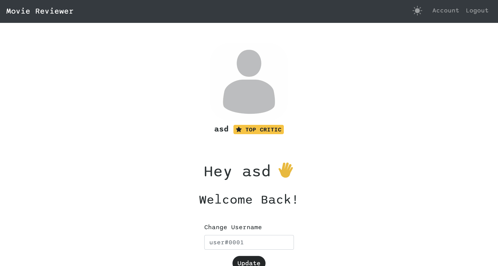